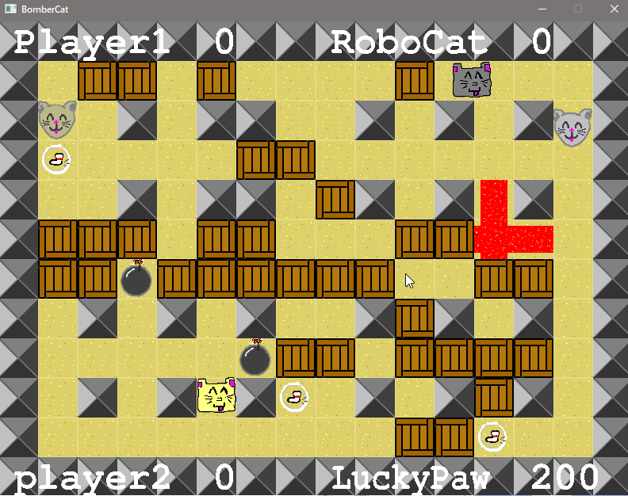

# BomberCat
This is simple implementation of classic 2D Bomberman game, written in C++ 
using OOP concepts and SDL2 library for graphics. All the sprites are drawn custom (yep, there wasn't much effort ... :)).

Game supports single player or two (local) players. There are always 4 players, rest are bots. The bots are not perfect, however, they tend to avoid the bombs quite reasonable.

## How to run
You can build the game using included makefile. Alternatively, if you trust me enough, I've included compiled executable, which should work on windows machines. 

## How to play
You know the rules, kill the other enemies by placing bombs and collect power-up. They can increase your speed, increase number of simultaneous bombs, make the explosion larger or you can collect cat coins and gain 200 score.

## Controls
### Single Player
- WASD for movement, SPACE for placing the bomb

### Two Players
- First player's controls remain the same -
- Second player: arrows for movement, RIGHT SHIFT for placing the bomb
